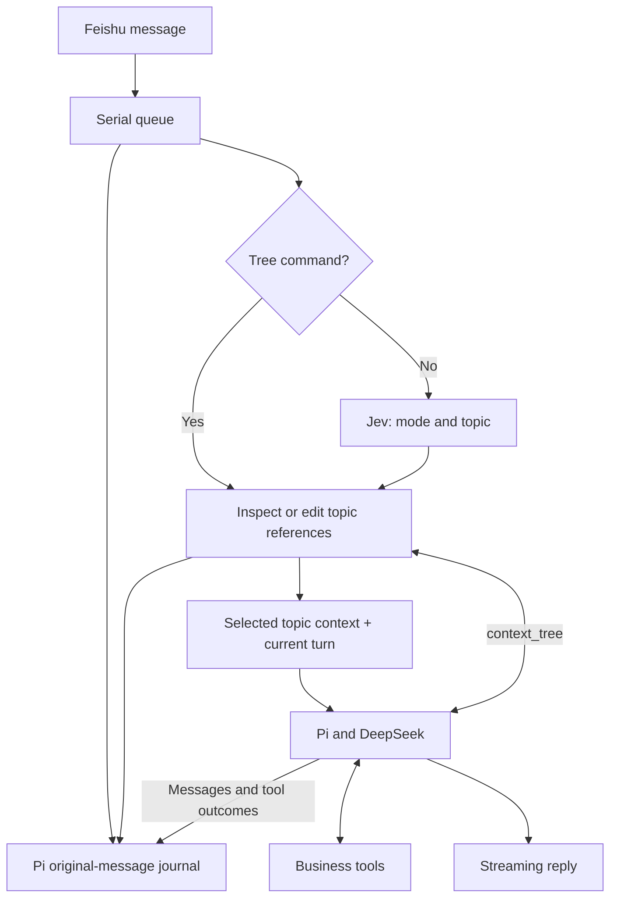

# Context tree

One Pi agent executes tools. A forest of topic branches selects its context;
an append-only Pi journal preserves original dialogue and tool outcomes.
Changing topics or compacting a branch never deletes those originals.

## What is stored

`agent/journal.ts` adapts Pi's `JsonlSessionRepo`. The main branch records original
user wording, model messages, tool calls/results and whether the reply completed.
`agent/context-tree.ts` creates a Pi branch per topic and appends references to
complete turns. The control branch records active-topic changes and undo events.
Membership is projected from these events; moving a turn does not rewrite messages.

This first version is a shallow topic forest. It does not infer a deep hierarchy,
clone agents, maintain several competing history stores, or replay past operations.
Each turn has one current topic; its stable ID still opens the original evidence.

## How a message gets context

`agent/tree-router.ts` sends Jev the current message, ten complete recent exchanges,
and previews of up to twelve recent topics. Two choice questions select response
mode (`greet`, `chat`, `task`) and topic (`current`, `new`, an existing ID, or `search`).
Mode changes alone do not change topics. Valid low-confidence choices are retained
and logged. The pinned model is `jev-1.13.0`; the timeout is three seconds.

`agent/session.ts` selects or creates the topic, attaches the current turn, and
rebuilds its model context from original messages or its last compaction checkpoint.
A greeting starts a clean topic. A follow-up can select an earlier topic with its
actual tool results. `search` restores the sole historical topic directly when
there is only one; otherwise it returns ranked candidates without executing work.
Routing outages keep the active topic plus ten recent original exchanges; this
preserves nearby referents but can expose old work during casual conversation.

An automatic switch to an existing topic also retains the immediately preceding
complete turn in chronological order. This lets the main model check a classifier's
choice against the latest referent. Explicit new topics and greetings stay clean;
manual `/tree use` remains an explicit selection. This short bridge is not a second
history store or a rewrite of either topic's originals.

The system prompt and tool list stay stable. Topic IDs, current time and changed
memory are appended with the current user message. Mode only controls runtime and
curated-memory inclusion; it no longer chooses a separate social history view.
Compaction remains token-budget based and preserves complete recent turns/tool pairs.
Its checkpoint belongs to a topic; membership corrections invalidate checkpoints.

## Inspect and repair in chat

| Command | Effect |
| --- | --- |
| `/tree` | Topic IDs, titles, turn counts and the active pointer. |
| `/tree show <topic or turn ID> [offset]` | Original wording and recorded tool results. |
| `/tree context [offset]` | The latest actual serialized main-model request, topic and source IDs. |
| `/tree search <words>` | Candidate topics with matching source turns. |
| `/tree new [title]` | Start an empty topic. |
| `/tree use <topic ID>` | Select an existing topic. |
| `/tree move <turn ID> <topic ID>` | Correct a complete turn's membership. |
| `/tree undo` | Undo the last manual/model context edit, including after restart. |

Long reads return `nextOffset`. Slash commands bypass the model. Context inspection
shows what was actually sent, including tool declarations, rather than a proposed
message list; the private snapshot is overwritten after each main-model request.
No GUI is involved.

The always-available `context_tree` tool provides the same operations plus paged
recent-turn access. Natural corrections can use it to find candidates, switch or
move turns. When it changes membership/selection, the next iteration of the **same**
tool loop receives repaired context while retaining the live tool call/result.
An ambiguous request returns candidates rather than performing a guessed mutation.
Search ranks lexical matches in wording/tool evidence, then the active topic and
recency; it is not embedding search or a guarantee of semantic relevance.

## Persistence and boundaries

Pi stores the journal, topic references and checkpoints in `.private/memory/sessions/`.
`context-latest.json` contains the latest model request; `memories.json` stores
distilled long-term facts separately. Keep this entire directory private.

On first use, `transcript.json` is backed up as `transcript.legacy.json` and imported
with original IDs/timestamps. Existing unassigned turns enter one explicitly labelled
history topic; migration does not guess boundaries or invent missing tool results.
Interrupted turns retain known observations without claiming an unfinished reply
succeeded. Restart reconstructs topic membership and undo state without executing
stored calls. Before rollback, preserve the whole private memory directory: an old
runtime cannot read new journal entries from the legacy file.

Source preservation and undo are deterministic. Topic classification, searching
when needed, and natural replies still depend on models. Inspect both the actual
request and the reply; see [evaluation and references](context-architecture.md).
